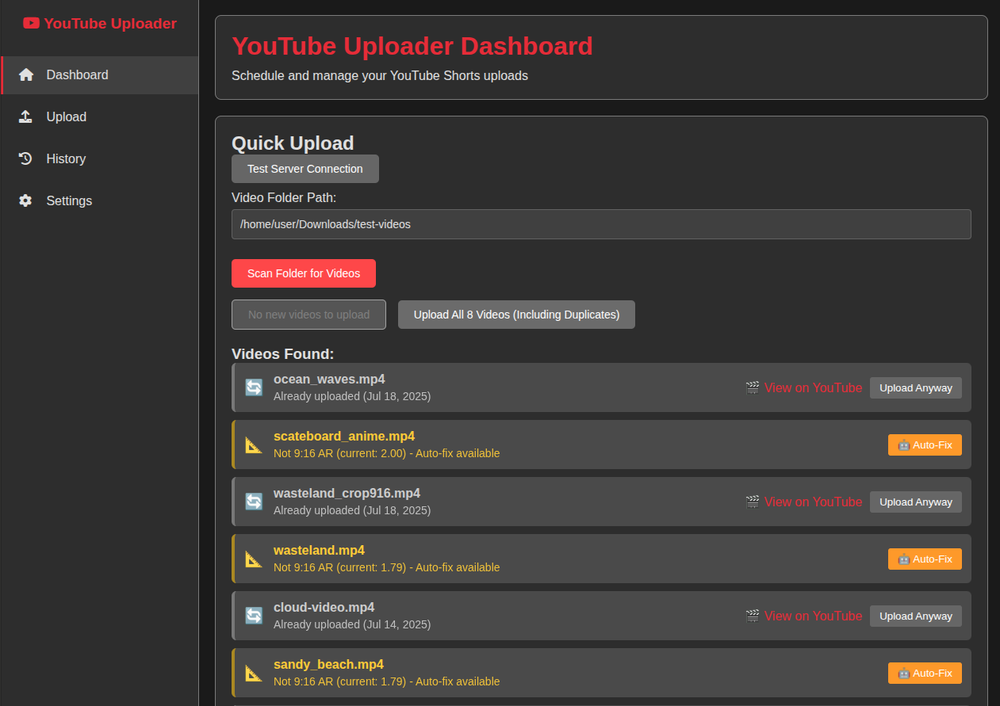
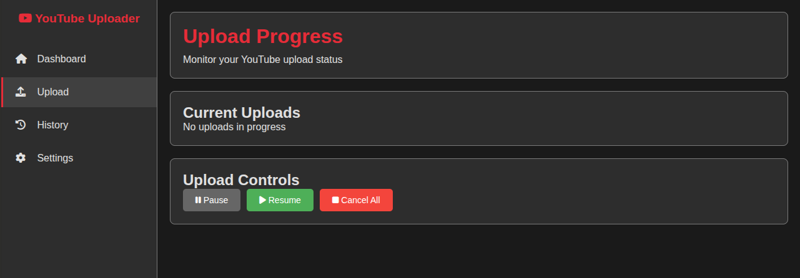
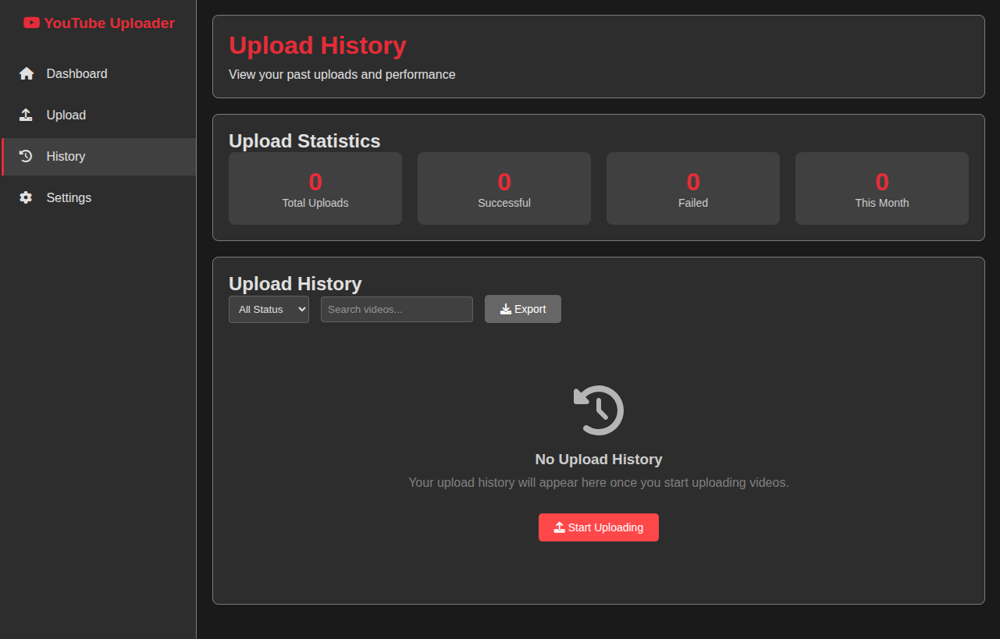

# Linux Media Uploader

Simple YouTube Shorts uploader that handles 9:16 aspect ratio videos with smart cropping features.

## Features

- Upload videos directly to YouTube Shorts
- Automatic video cropping for oversized content
- Web-based interface for easy management
- Upload history tracking
- Configurable settings
- Authentication handling for YouTube API

## Screenshots

### Main Dashboard


The main dashboard provides quick access to all uploader functions and shows system status.

### Upload Page


Upload interface handles file selection and provides real-time feedback during the upload process.

### Settings Page


Configure API settings, video processing options, and authentication credentials.

### History Page


Track all previous uploads with timestamps and status information.

## Setup

1. Clone this repository
2. Install dependencies: `pip install -r requirements.txt`
3. Copy `client_secrets_template.json` to `client_secrets.json`
4. Add your YouTube API credentials to `client_secrets.json`
5. Run with `./start.sh` or `python app.py`

## Requirements

- Python 3.8+
- YouTube Data API v3 credentials
- Linux Debian/Ubuntu system
- Web browser for interface access

## File Structure

```
├── app.py                    # Main Flask application
├── video_processor.py        # Video processing logic
├── client_secrets.json       # YouTube API credentials (not included)
├── config.json              # Application configuration
├── history.json             # Upload history storage
├── requirements.txt         # Python dependencies
├── start.sh                 # Launch script
├── static/                  # Web assets (CSS, JS)
├── templates/               # HTML templates
└── screenshots/             # Interface screenshots
```

## Usage

The application runs a local web server that provides an interface for:

- Selecting video files for upload
- Automatic aspect ratio detection and cropping
- Setting video titles and descriptions
- Monitoring upload progress
- Viewing upload history

Videos are automatically processed to meet YouTube Shorts requirements (9:16 aspect ratio, under 60 seconds).

## API Authentication

You need YouTube Data API v3 credentials. Get them from Google Cloud Console and place them in `client_secrets.json` following the template structure.

The app handles OAuth2 authentication flow automatically on first use.